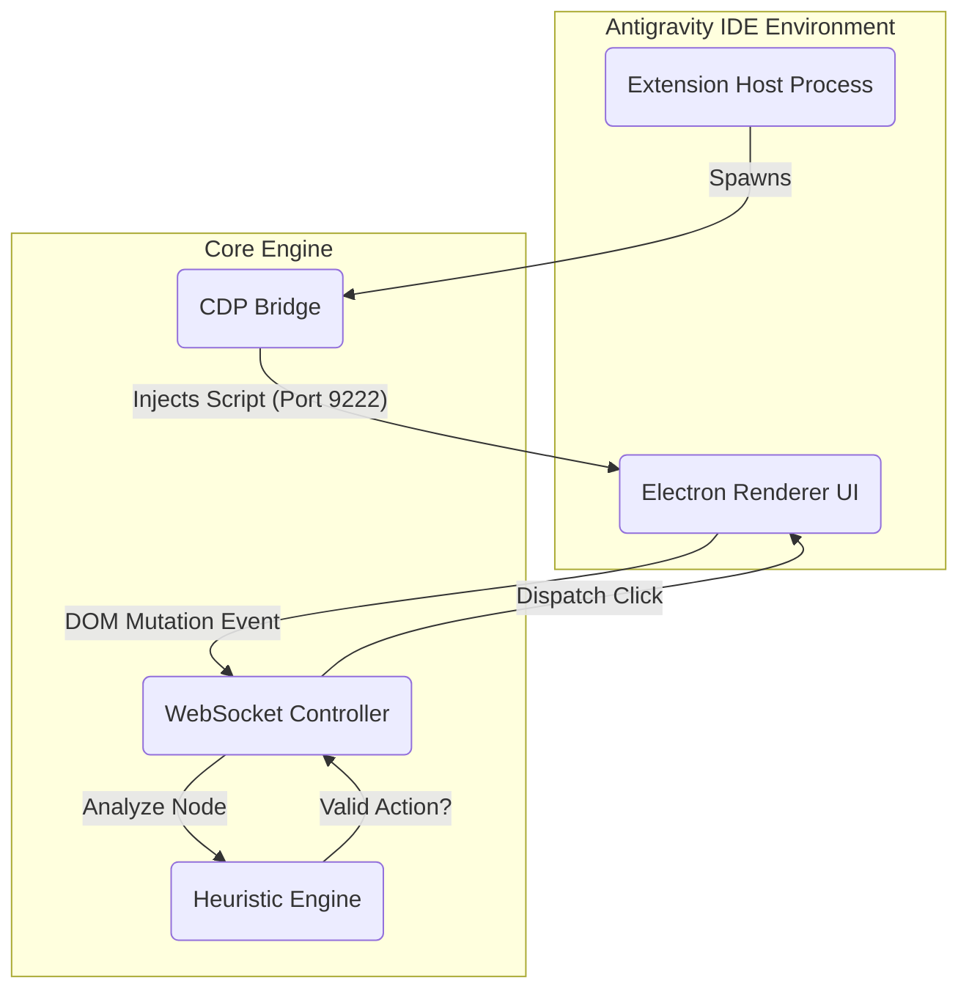

# Free Auto Accept for Antigravity


**An unrestricted, high-performance automation engine for Google Antigravity IDE.**

Free Auto Accept eliminates the "Human-in-the-Loop" bottleneck by autonomously handling agent permissions, run requests, and background tasks. Built with a direct CDP (Chrome DevTools Protocol) bridge, it offers zero-latency execution without the artificial limitations found in other tools.

[Background Mode](#background-mode) · [Installation](#installation) · [Architecture](#architecture) · [Contributing](#contributing)

---

## Introduction

In the era of Agentic AI, developers spend up to 40% of their time simply clicking "Approve" or "Run" for autonomous agents. Existing solutions often impose rate limits, require "Pro" subscriptions for basic background functionality, or fail to handle complex multi-window setups.

**Free Auto Accept** solves this by bypassing standard extension API limitations. It injects a lightweight, event-driven controller directly into the IDE's renderer process, enabling:

-   **Instant Execution**: < 10ms reaction time to agent requests.
-   **True Background Mode**: Works across all open tabs, even when minimized.
-   **Privacy First**: 100% local execution. No telemetry. No external servers.

## Key Features

-   🚀 **Turbo Performance**: Optimized for high-end hardware (200ms constant polling) for instant <10ms reaction time.
-   🌐 **Global Context Awareness**: Intelligently manages focus and execution across multiple agent windows simultaneously.
-   🛡️ **Intelligent Safety**: Built-in "Banned Commands" filter ensures destructive operations (e.g., `rm -rf`, `format c:`) are never auto-accepted.
-   👻 **Shadow DOM Support**: Penetrates deeply nested webviews to find buttons hidden from standard selectors.
-   🔓 **Fully Unlocked**: All "Pro" features (Background Mode, Custom Banned Commands, Multi-window) are free forever.

## Architecture

The system employs a **Sidecar Pattern**, spawning a local WebSocket controller that bridges the VS Code Extension Host with the Electron Renderer process.



1.  **CDP Bridge**: Establishes a raw debug connection to the IDE's internal browser tabs.
2.  **WebSocket Controller**: Maintains a persistent, bi-directional link for real-time events.
3.  **Heuristic Engine**: Analyzes button text, attributes, and context (Shadow DOM) to determine intent.

## Installation

### Prerequisites

-   **Antigravity IDE** (Latest Version)
-   **Windows**, **macOS**, or **Linux**

### Manual Installation (Developer Mode)

1.  **Clone the Repository**
    ```bash
    git clone https://github.com/RendezvousP/free-auto-accept-antigravity.git
    ```

2.  **Deploy to Extensions Directory**
    *   **Windows**: Move to `%USERPROFILE%\.antigravity\extensions\`
    *   **macOS/Linux**: Move to `~/.antigravity/extensions/`

3.  **Activate**
    *   Restart Antigravity IDE completely.
    *   Look for the status indicator: `$(zap) Auto Accept: ON`.

## Configuration

The extension works out-of-the-box with sensible defaults. However, you can customize behavior via the Command Palette (`Ctrl+Shift+P`).

| Command | Description |
| :--- | :--- |
| `Free Auto Accept: Toggle ON/OFF` | Enable or disable the automation engine globally. |
| `Free Auto Accept: Relaunch` | Force restart the CDP bridge if connection is lost. |

### Environment Variables

While not required, power users can tune the internal engine by modifying `extension.js`:

```javascript
// extension.js
const POLL_FREQUENCY = 1000; // Adjust polling interval (ms)
const isBackgroundMode = true; // Toggle background execution
```

## Project Structure

A clean, modular architecture ensures maintainability and ease of contribution.

```plaintext
free-auto-accept/
├── main_scripts/           # Core Automation Logic
│   ├── cdp-handler.js      # Chrome DevTools Protocol logic
│   ├── full_cdp_script.js  # Injected browser-side heuristics
│   └── relauncher.js       # Connection recovery system
├── extension.js            # VS Code Extension entry point
├── package.json            # Manifest & Metadata
└── README.md               # Documentation
```

## Contributing

We believe in open automation. Contributions are welcome for new button patterns, performance optimizations, or platform support.

1.  **Fork** the repository.
2.  Create a **Feature Branch** (`git checkout -b feature/dynamic-polling`).
3.  **Commit** your changes (`git commit -m 'feat: Add dynamic polling rate'`).
4.  **Push** to the branch (`git push origin feature/dynamic-polling`).
5.  Open a **Pull Request**.

## Roadmap

-   [x] **v1.0**: Core Auto-Accept & Background Mode (Completed).
-   [x] **v1.1**: Shadow DOM traversal for deep UI support (Completed).
-   [ ] **v1.2**: User-configurable "Banned Words" list via UI.
-   [ ] **v2.0**: OCR-based button detection for canvas-based UIs.

## License

Distributed under the **MIT License**. See `LICENSE` for more information.

---

<p align="center">
  Built with ❤️ for the Antigravity Community.
</p>
